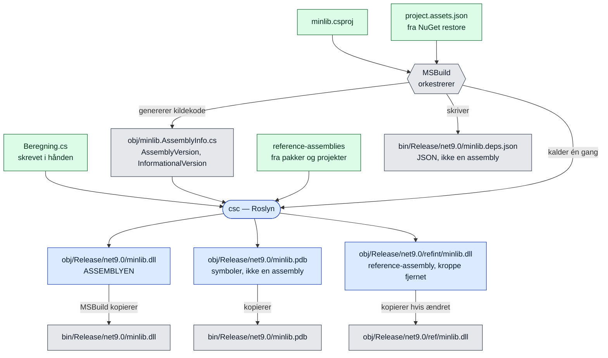
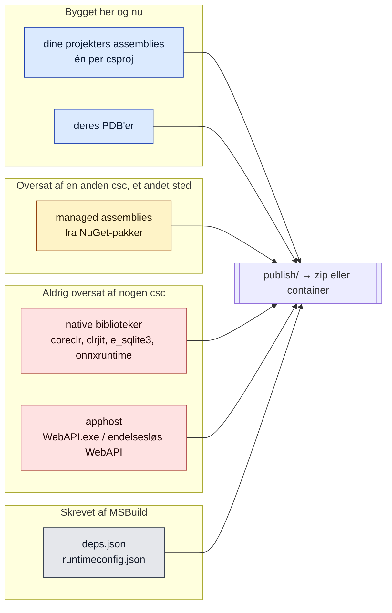
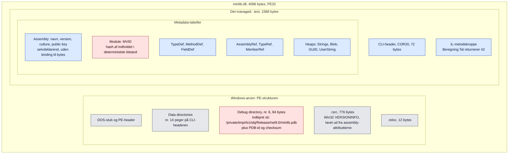

# Hvem laver hvad i et .NET-byg

Baggrundsnotat, ikke et eksperiment. Skrevet 8. september 2026 fordi
arbejdsdelingen mellem MSBuild og Roslyn er nem at blande sammen, og fordi
opdelingen afgør hvordan et reproducerbarhedstal skal læses.

Kort: **Roslyn laver præcis én assembly per projekt. MSBuild laver ingen.**
MSBuild løser referencer, genererer kildekode, kalder oversætteren én gang, og
kopierer så filer rundt.

## Ét projekt, ét kald til oversætteren



Blå er det csc skriver. Grå er MSBuilds arbejde: genereret kildekode, kopier og
JSON. Grøn er input.

To ting er værd at holde fast i. `bin/.../minlib.dll` er en **kopi** —
originalen ligger i `obj/`, og de to er bit-identiske (verificeret 8/9:
`541bed823d12e42b…` på begge stier). Derfor hedder oprydningen `rm -rf bin obj`
og ikke bare `rm -rf bin`: slettes kun `bin`, ser MSBuild at `obj` er aktuel,
kopierer tilbage, og kalder aldrig csc. Et "rent byg" ville have været en
genkopiering.

Og `minlib.AssemblyInfo.cs` findes ikke i noget repo. MSBuild skriver den under
byggeriet og oversætter den med — det er dér `AssemblyInformationalVersion`
kommer fra. Versionsstrengen i en færdig binær har altså ingen kilde man kan
pege på i git.

## Hvad et release-artefakt så består af



Den opdeling er hele grunden til at notatet findes. Et tal som "X af Y filer
bit-identiske ved gentagelse" siger næsten ingenting, hvis de fleste af Y er
kopierede bytes: de er identiske per konstruktion, fordi ingen har oversat dem
igen. Kun den blå gruppe er noget vores byg frembringer, og den er lille — en
håndfuld assemblies i et output på hundredvis af filer.

Så en ærlig baseline rapporterer tre tal, ikke ét: bygget her, kopieret ind, og
genereret metadata.

## Hvordan man ser hvad en fil er

Endelsen er kun en konvention. `file` kigger på PE-headeren og finder
CLI-headeren, som er det der gør en PE-fil managed:

```bash
file bin/Release/net9.0/minlib.dll
```

    PE32 executable for MS Windows (DLL), Intel i386 Mono/.Net assembly, 3 sections

En PDB svarer "Microsoft Roslyn C# debugging symbols", et native bibliotek
"ELF 64-bit LSB shared object". Bemærk at "Intel i386" står på en
arkitekturneutral assembly — managed PE'er markeres som 32-bit-preferred i
headeren, og det skal ikke læses som et 32-bit-byg.

De `.dll`-filer i et output der *ikke* er assemblies, findes med:

```bash
find . -name '*.dll' -exec file {} + | grep -v 'Mono/.Net assembly'
```

Og et overblik over hele mappen:

```bash
find . -type f -print0 | xargs -0 file | sed 's/.*: //' | cut -c1-45 | sort | uniq -c | sort -rn
```

## Forbehold

- Diagrammerne beskriver et SDK-projekt bygget med `dotnet build` eller
  `dotnet publish`. Enkeltfil-publish, AOT og trimming flytter grænserne.
- csc kan emittere mere end vist: `/target:module` giver en `.netmodule` med IL
  og metadata men uden assembly-manifest — den rene "ikke en assembly". CoreCLR
  kan ikke indlæse den, så den optræder ikke i praksis.
- Antallet af native filer afhænger af hvilke pakker projektet trækker ind.

## Hvad der ligger inde i en assembly

Målt på `bin/Release/net9.0/minlib.dll` fra laboratoriet, 8. september 2026.
Filen er 4096 bytes i alt — en tom klasse med én metode.



Rødt er det der flyttede sig i vores målinger. Blåt er det der stod stille.

Det er værd at se hvor lidt af filen der er kode. `.text` er 1588 bytes og
rummer både CLI-header, alle metadata-tabeller og IL'en. `.rsrc` er 776 bytes
Windows-ressource — en VERSIONINFO-blok genereret ud af de samme
assembly-attributter MSBuild skrev i `AssemblyInfo.cs`. Versionsnummeret står
altså to steder i filen: som metadata i Assembly-tabellen, og som en Windows-
ressource. Ingen af dem er bundet til indholdet.

To ting i diagrammet forklarer alt hvad vi har målt:

**Debug directory, 84 bytes.** Her står en absolut sti til PDB-filen — og
bemærk at DLL'en i `bin/` peger på en PDB i `obj/`. Det er den streng
`+build_path` ændrer, og derfor den akse vi forventer falder. Samme sted ligger
PDB-id og checksum, som følger med når PDB'en ændrer sig.

**MVID i Module-tabellen.** I deterministisk tilstand er den en hash af det
oversatte indhold. Den er derfor afledt: ændrer noget som helst sig, ændrer
MVID'et sig med. Det er grunden til at én årsag — en sti — gav 189 afvigende
byte-positioner den 19. august. Én kilde, mange spor.

Resten — IL, typer, referencer, heaps — er indhold, der kun ændrer sig hvis
kildekoden eller oversætteren gør.
