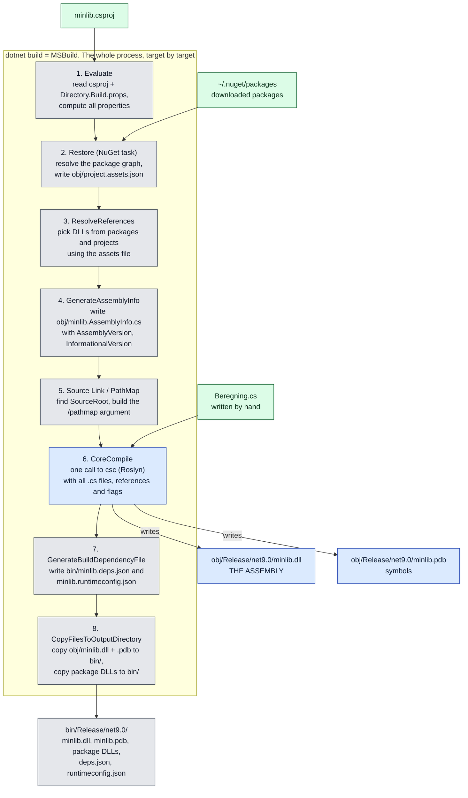
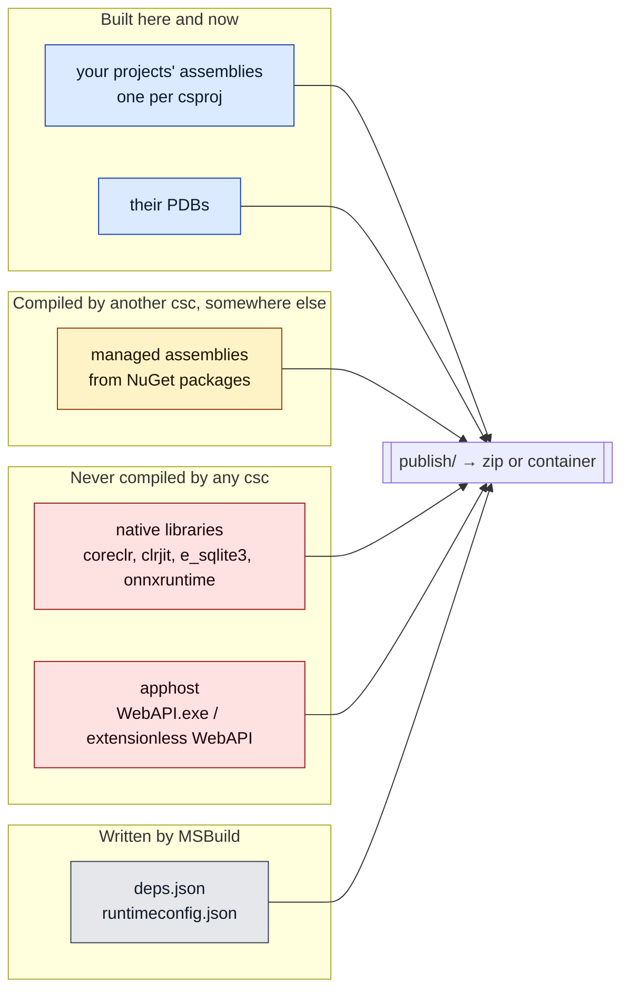
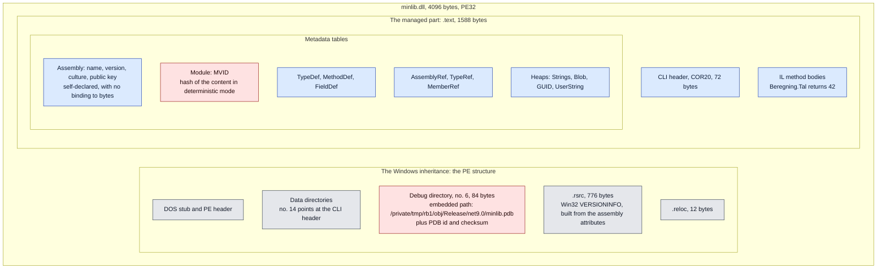

# Who does what in a .NET build

Background note, not an experiment. Written 8 September 2026 because the
division of labour between MSBuild and Roslyn is easy to confuse, and because
that division decides how a reproducibility number should be read.

Short version: **Roslyn produces exactly one assembly per project. MSBuild
produces none.** MSBuild resolves references, generates source, calls the
compiler once, and then copies files around.

## One project, one call to the compiler



The big box is all of `dotnet build`. Everything in it is MSBuild running its
targets in order. Blue is the single step where compilation happens: MSBuild
calls csc once per project, and csc writes exactly two files back into `obj/`.
All the grey steps are MSBuild's own work: read, resolve, generate, copy. Green
is input.

The steps carry the names they have in the SDK's targets files, so you can look
them up with `dotnet build -v:n` and watch them go by. The order is simplified:
a real build has around a hundred targets, and several of them run between the
ones shown.

Two things are worth holding on to. `bin/.../minlib.dll` is a **copy**. The
original sits in `obj/`, and the two are bit-identical (verified 8/9:
`541bed823d12e42b…` on both paths). That is why the cleanup is `rm -rf bin obj`
and not just `rm -rf bin`: delete only `bin` and MSBuild sees that `obj` is
current, copies back, and never calls csc. A "clean build" would have been a
re-copy.

And `minlib.AssemblyInfo.cs` exists in no repo. MSBuild writes it during the
build and compiles it along with the rest. That is where
`AssemblyInformationalVersion` comes from. The version string in a finished
binary therefore has no source you can point at in git.

## What a release artefact then consists of



That split is the whole reason this note exists. A number like "X of Y files
bit-identical on repetition" says almost nothing if most of Y are copied bytes:
they are identical by construction, because nobody compiled them again. Only the
blue group is something our build produces, and it is small, a handful of
assemblies in an output of hundreds of files.

So an honest baseline reports three numbers, not one: built here, copied in, and
generated metadata.

## How to see what a file is

The extension is only a convention. `file` looks at the PE header and finds the
CLI header, which is what makes a PE file managed:

```bash
file bin/Release/net9.0/minlib.dll
```

    PE32 executable for MS Windows (DLL), Intel i386 Mono/.Net assembly, 3 sections

A PDB answers "Microsoft Roslyn C# debugging symbols", a native library "ELF
64-bit LSB shared object". Note that "Intel i386" appears on an
architecture-neutral assembly: managed PEs are marked 32-bit-preferred in the
header, and that should not be read as a 32-bit build.

The `.dll` files in an output that are *not* assemblies are found with:

```bash
find . -name '*.dll' -exec file {} + | grep -v 'Mono/.Net assembly'
```

And an overview of the whole directory:

```bash
find . -type f -print0 | xargs -0 file | sed 's/.*: //' | cut -c1-45 | sort | uniq -c | sort -rn
```

## Caveats

- The diagrams describe an SDK project built with `dotnet build` or
  `dotnet publish`. Single-file publish, AOT and trimming move the boundaries.
- csc can emit more than what is shown: `/target:module` gives a `.netmodule`
  with IL and metadata but no assembly manifest, the pure "not an assembly".
  CoreCLR cannot load it, so it does not show up in practice.
- The number of native files depends on which packages the project pulls in.

## What is inside an assembly

Measured on `bin/Release/net9.0/minlib.dll` from the lab, 8 September 2026. The
file is 4096 bytes in total, an empty class with one method.



Red is what moved in our measurements. Blue is what stood still.

It is worth seeing how little of the file is code. `.text` is 1588 bytes and
holds the CLI header, all the metadata tables and the IL. `.rsrc` is 776 bytes
of Windows resource, a VERSIONINFO block generated from the same assembly
attributes MSBuild wrote in `AssemblyInfo.cs`. The version number therefore
appears twice in the file: as metadata in the Assembly table, and as a Windows
resource. Neither is bound to the content.

Two things in the diagram explain everything we have measured.

**Debug directory, 84 bytes.** It holds an absolute path to the PDB file, and
note that the DLL in `bin/` points at a PDB in `obj/`. That is the string
`+build_path` changes, and therefore the axis we expect to fail. The same place
holds the PDB id and checksum, which follow along when the PDB changes.

**MVID in the Module table.** In deterministic mode it is a hash of the compiled
content. It is therefore derived: if anything changes, the MVID changes with it.
That is why one cause, a path, produced 189 differing byte positions on 19
August. One source, many traces.

The rest, IL, types, references, heaps, is content that changes only if the
source or the compiler does.
